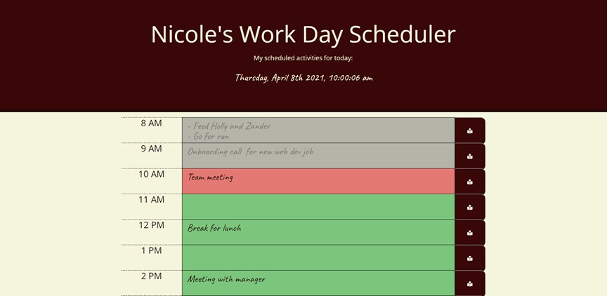

# 05 Third-Party APIs: Work Day Scheduler

## Description

I created a simple calendar application that allows a user to save events for each hour of the day by modifying starter code. This app will run in the browser and feature dynamically updated HTML and CSS powered by jQuery.  The [Moment.js](https://momentjs.com/) library was implemented for the date and time. Some base html and css was provided and modified as needed.


## User Story

```
AS AN employee with a busy schedule
I WANT to add important events to a daily planner
SO THAT I can manage my time effectively
```

## Key Features

```
* User can enter daily activities by hour and save them to local storage
* The current day and time displays dynamically without refreshing the page
* User can identify past, present, and future activities based on dynamic color coding
* The user can delete all planner entries by pressing a delete button

```
## Tools Used

```
* HTML
* CSS
* JQuery
* Bootstrap
* Moment.js
* JavaScript

```

## Screen Capture

The following shows the visual display and functionality of the day planner:


Notice time block color changes as the hour changes.




## Deployed application

The URL of the deployed application.
https://ndaruwalla.github.io/day-planner/

## GitHub repository

The URL of the GitHub repository that contains my code.
https://github.com/NDaruwalla/day-planner/


---


